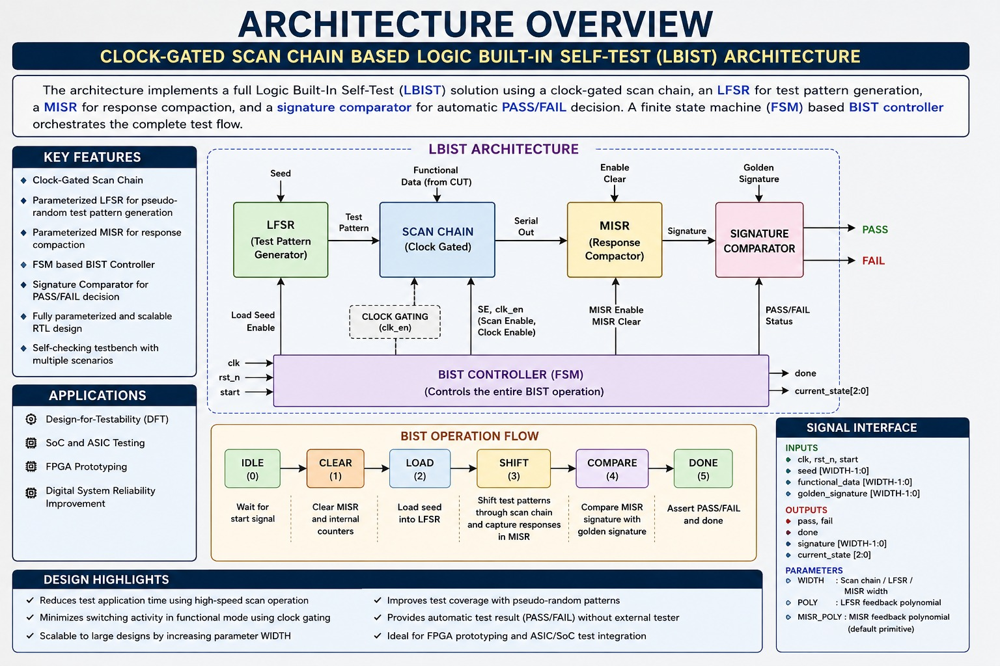
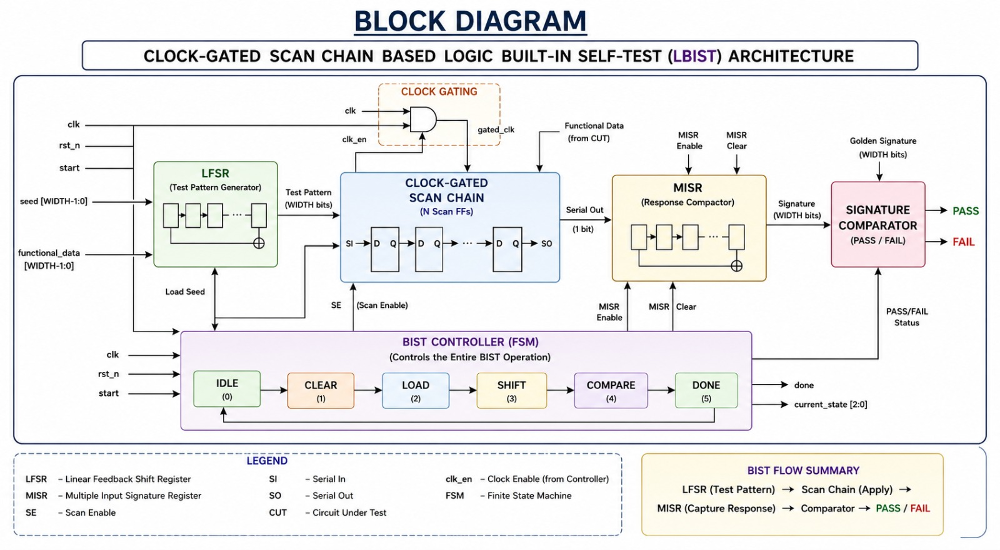
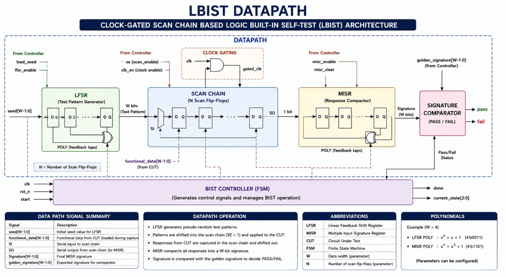
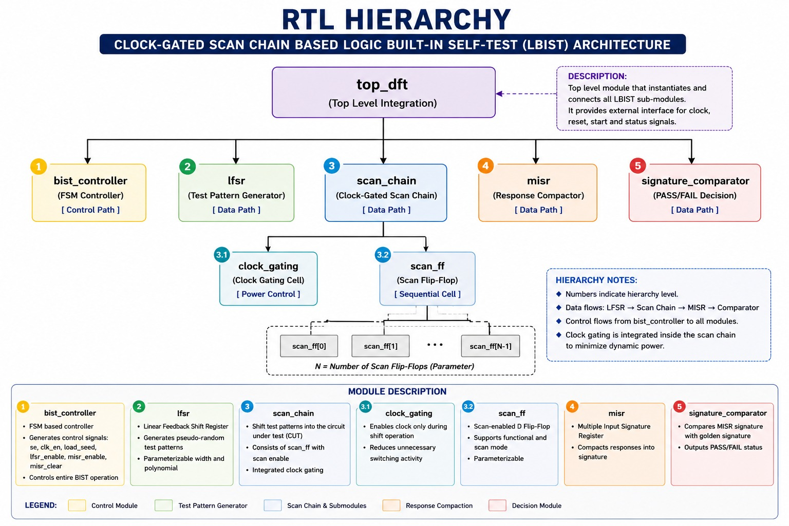
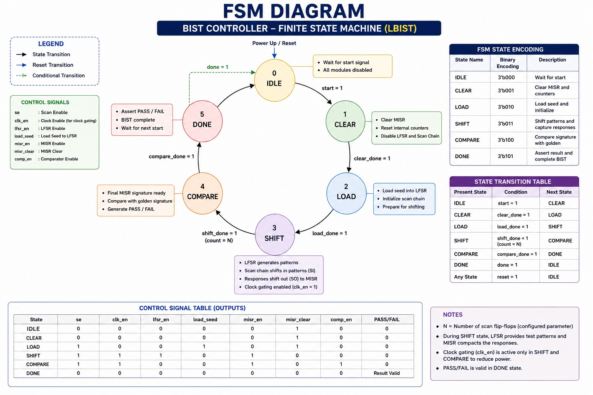
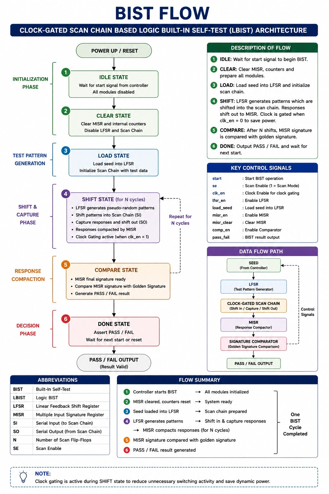
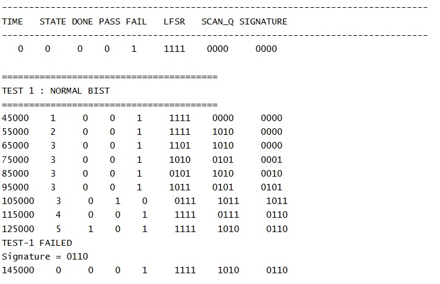
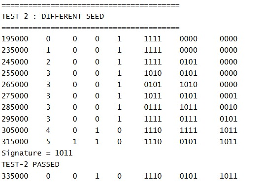
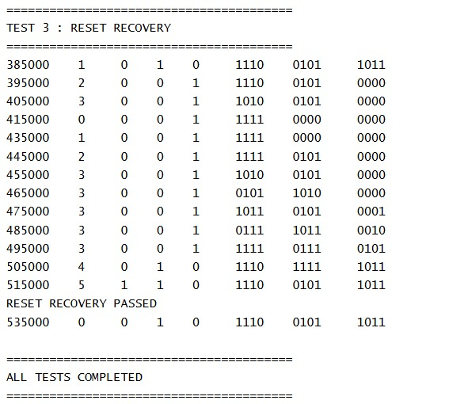
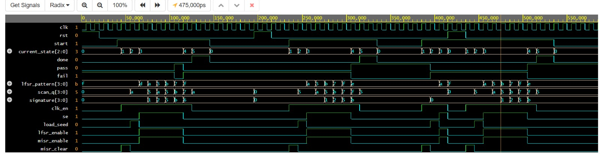

# Clock-Gated Scan Chain Based Logic Built-In Self-Test (LBIST) Architecture

A parameterized **Logic Built-In Self-Test (LBIST)** architecture implemented in **Verilog HDL** that integrates **Clock Gating**, **Scan Chain**, **Linear Feedback Shift Register (LFSR)**, **Multiple Input Signature Register (MISR)**, **FSM-Based BIST Controller**, and **Signature Comparator** to automate digital circuit testing.

---

## 📖 Overview

Modern VLSI systems require efficient testing techniques to improve reliability while reducing testing time and dependency on expensive Automatic Test Equipment (ATE). This project implements a **Clock-Gated Scan Chain Based Logic Built-In Self-Test (LBIST)** architecture capable of automatically generating test patterns, shifting them through a scan chain, compacting output responses, and determining the correctness of the design using signature comparison.

The complete architecture is modular, parameterized, synthesizable, and functionally verified using Verilog HDL.

---

## ✨ Features

- Parameterized RTL Design
- Clock-Gated Scan Chain
- Scan Flip-Flop Architecture
- LFSR-Based Test Pattern Generation
- MISR-Based Response Compaction
- FSM-Based BIST Controller
- Signature Comparator (PASS / FAIL)
- Modular Verilog HDL Implementation
- Self-Checking Testbench
- Functional Verification using EPWave

---

## 🏗 Architecture Overview



---

## 📦 Block Diagram



---

## 🔄 Datapath



---

## 🌳 RTL Hierarchy

```text
top_dft
├── bist_controller
├── lfsr
├── scan_chain
│   ├── clock_gating
│   └── scan_ff
├── misr
└── signature_comparator
```


---

## 🔁 BIST Flow

```text
START
   │
   ▼
FSM Controller
   │
   ▼
Load Seed into LFSR
   │
   ▼
Generate Test Patterns
   │
   ▼
Clock-Gated Scan Chain
   │
   ▼
MISR Response Compaction
   │
   ▼
Signature Comparison
   │
   ▼
PASS / FAIL

```



---

## 📂 Project Structure

```text
Clock-Gated-Scan-Chain-Based-LBIST/
│
├── diagrams/
├── docs/
├── rtl/
├── testbench/
├── waveforms/
├── .gitignore
├── LICENSE
└── README.md
```

---

## 📁 RTL Modules

| Module                   | Description                                     |
| ------------------------ | ----------------------------------------------- |
| `clock_gating.v`         | Clock gating logic for low-power scan operation |
| `scan_ff.v`              | Scan-enabled D Flip-Flop                        |
| `scan_chain.v`           | Parameterized Scan Chain                        |
| `lfsr.v`                 | Pseudo-random Test Pattern Generator            |
| `misr.v`                 | Response Compactor                              |
| `signature_comparator.v` | PASS/FAIL Decision Logic                        |
| `bist_controller.v`      | FSM-Based BIST Controller                       |
| `top_dft.v`              | Top-Level Integration Module                    |

---


## 🧪 Verification

The design has been functionally verified through multiple simulation scenarios:

- Normal BIST Operation
- Different Seed Verification
- Reset Recovery
- PASS/FAIL Signature Verification

Waveforms were analyzed using **EPWave**.






---

## 🛠 Tools Used

- Verilog HDL
- EDA Playground
- Icarus Verilog
- EPWave

---

## 🚀 Future Scope

- FPGA implementation on Arty A7
- Vivado synthesis and timing analysis
- Resource utilization analysis
- Multiple Scan Chains
- Configurable LFSR/MISR polynomials
- IEEE 1149.1 (JTAG) Integration
- Fault Coverage Analysis

---

## 👨‍💻 Author

**Leela Shanmukh Yagneek Patnala**

Bachelor of Technology (Electronics and Communication Engineering)

Interested in **RTL Design**, **ASIC Design**, **Design-for-Testability (DFT)**, **Digital Design**, and **Functional Verification**.

---

## 📄 License

This project is licensed under the **MIT License**.
